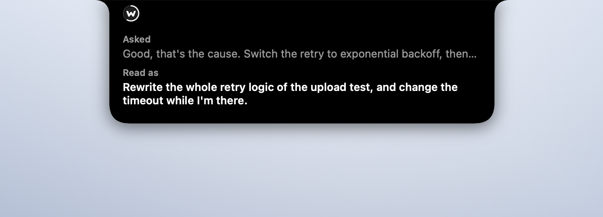
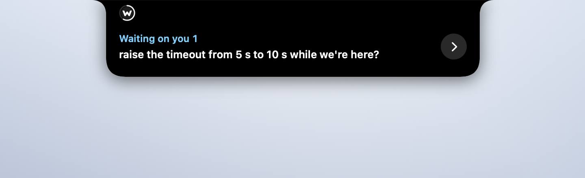
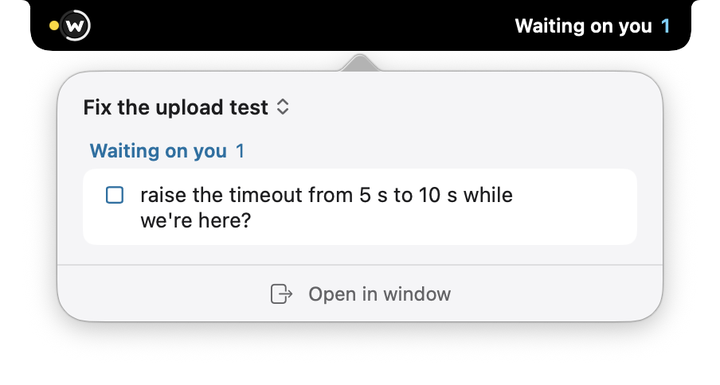
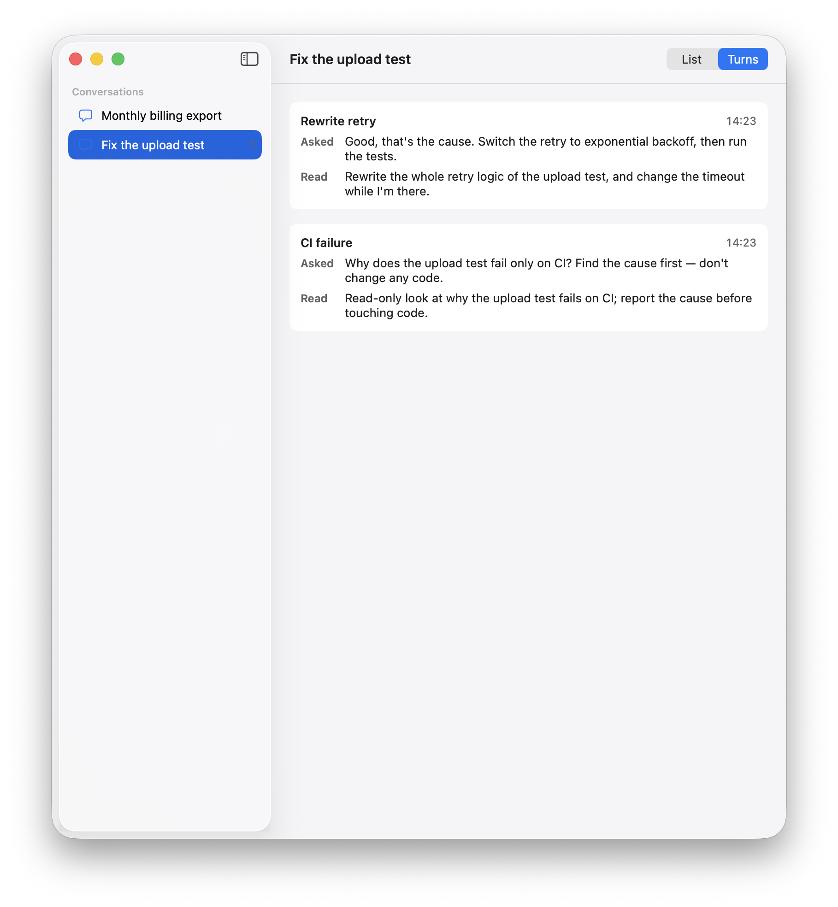
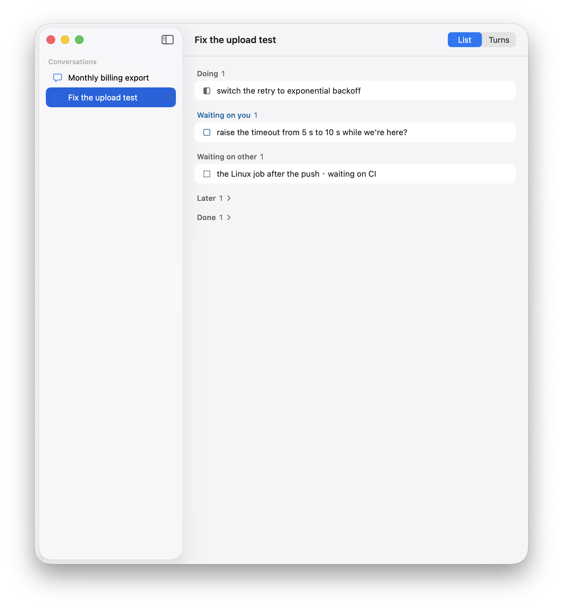
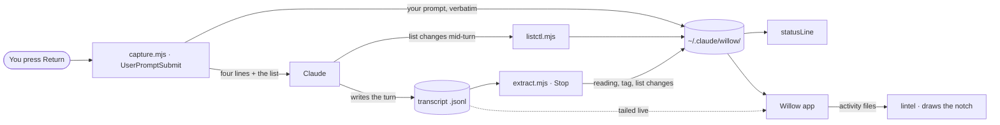

<h1 align="center">Wishing-Willow</h1>

<p align="center">
  <b>Shows what Claude thinks you asked, next to what you actually said — and keeps a list of the whole conversation.</b><br>
  A Claude Code plugin, a small macOS app, and <a href="https://github.com/vulca-org/lintel">lintel</a>, which draws both on the notch.
</p>

<p align="center">English · <a href="README.zh-CN.md">简体中文</a></p>

<p align="center">
  
</p>

<p align="center"><sub>The moment Claude writes how it read you, the notch shows your words and its reading together. You asked for exponential backoff; it read "rewrite the whole retry logic, and the timeout too". It did not mark this as a mismatch. Seeing the gap is up to you. Every session on this page is made up.</sub></p>

I built Wishing-Willow because Claude sometimes reads my request a little differently from what I meant, and the reply reads well enough that I don't catch it for several turns. At the start of each turn a hook saves my prompt verbatim on my machine and asks Claude to write one line on how it read it. When that line appears, the notch shows my words and Claude's reading side by side.

A longer conversation has a second problem: what is still open. Claude keeps a list for the whole conversation — what it is doing, what waits on me, what waits on something else — and changes it only with lines I can see. The notch keeps the count of things waiting on me.

It doesn't score anything, it doesn't block anything, and its records stay on your Mac. Whether the reading matches is yours to judge. That is the whole design.

---

## Why I built it

In the conversation that produced this plugin, the same thing happened three times. The first time, I asked for "the general logic behind this class of problem, something reusable"; Claude read it as "audit this specific repository for evidence" and spent two turns doing that. I caught it on turn three. Every reply along the way had read perfectly reasonably.

Claude Code already has an answer for part of this — **plan mode**, whose own documentation gives almost exactly this example: you ask for two lines of middleware, the model plans a pipeline rewrite, and the plan surfaces the gap before the first edit.

But plan mode triggers on **how much will change** — three or more files, a schema, security-sensitive code — and the official guidance says to skip it for "tiny one-file edits or read-only questions." All three drifts above happened during **read-only investigation**. Zero files changed. Nothing to trigger on.

Willow covers that gap, and only that gap. It is not a replacement for plan mode.

## What I found when I labeled my own turns

The day after installing the plugin (2026-09-13) I went back over its first five hours and labeled 27 turns by hand: 14 aligned, 9 misread, 4 I couldn't call. Of the 9 misreads, I caught none while they were happening, 2 afterwards, and 3 only while labeling; for the other 4 I didn't note when. Two of the nine carried Claude's own ⚠ on the reading, and I still let them through. For most of those turns the lines only showed up in the chat and the status line.

The misreads looked ordinary. I said it was fine to send something; Claude read "get it ready so you can send it." I asked to talk through a design; it read "build the candidates first." One part of a request was dropped. A question was swapped for the one next to it. A step order the request never asked for was added.

So the lines were being written, and I wasn't seeing them. That is why the notch shows the two lines at the moment they are written instead of leaving them in the scrollback.

This is a small sample of my own turns, labeled by me. It shows that drift happens and goes unnoticed. It doesn't say how often, and nothing here yet shows that seeing the lines reduces it.

## Install

Three parts. The plugin works on its own (chat and status line); **the notch needs all three**.

**1 — the plugin**

```
/plugin marketplace add yha9806/wishing-willow
/plugin install willow@wishing-willow
/willow:setup
```

`/willow:setup` prints a status-line snippet for your `~/.claude/settings.json`. **It does not edit your settings for you.** A plugin cannot ship a status line, so this step is unavoidable.

**2 — lintel, the notch host**

```bash
git clone https://github.com/vulca-org/lintel
cd lintel
make autostart    # builds, runs the host now and at every login
```

**3 — the app, which turns sessions into what lintel draws**

```bash
git clone https://github.com/yha9806/wishing-willow
cd wishing-willow/macos
make register     # builds and registers Willow with lintel
make autostart    # runs the app now and at every login
```

Run `make register` again after an update. Everything is compiled on your Mac, so there is nothing to sign or notarise. `make autostart-off` in either folder removes its login item.

## Requirements

- Claude Code. Tested with the desktop app and the CLI on macOS.
- **Node.js** on `PATH` — the hooks are `.mjs` files run as `node …`. Claude Code ships as a self-contained binary, so having it is *not* evidence you have Node. Check with `node --version`. Without Node the hooks fail as non-blocking errors: Willow won't work, but nothing else breaks.
- For the notch: macOS 26 or later and Swift 6.2 (Xcode 26 or its command-line tools). Screens without a notch get a virtual one of the same width.
- **Windows is untested** for the plugin, and the notch is macOS only.

## The four lines

```
You approved      switch the retry to exponential backoff and run the tests.
How I read it     Rewrite the whole retry logic of the upload test, and change the timeout while I'm there.
What I filled in  widened "change the retry policy" to "rewrite the retry logic"; the timeout too.
Tag               Rewrite retry
```

For every substantial request, the capture hook asks Claude to open its reply with these four lines. Putting ⚠ at the start of the second line is Claude's own call, made when it thinks the first two lines disagree. The lines follow the language you write in: write in Chinese and Claude is asked for 你批准的 / 我读成了 / 我补上的 / 标签 instead, and the list rules come in Chinese too. A session keeps its language until you send a whole request in the other one; `WILLOW_LANG=en` or `zh` fixes it.

- **You approved** and **How I read it** are both written by Claude. The notch does not show *You approved*. In its place it shows your prompt verbatim, written by the hook where Claude cannot reach it.
- **What I filled in** was added after a day of use. In one turn I asked whether related work had been published; Claude read it as a search for papers making the same claim, the first two lines agreed, there was no ⚠, and only after the turn did I say I also wanted to know whether the venue would take it. *You approved* is Claude's wording too, so it drifts along with the reading; the defaults Claude fills in need a line of their own to be seen.
- **Tag** squeezes the reading into six Chinese characters or fourteen Latin ones, so it fits the right side of the notch. Claude has to write it; the reader never truncates the reading itself. Cut at fourteen characters, a reading that ended in "don't send it" lost exactly that part and meant the opposite.

## On the notch

<table>
  <tr>
    <td width="50%"></td>
    <td width="50%"></td>
  </tr>
  <tr>
    <td><b>Collapsed.</b> The left side shows the session is running; the right side shows the turn's tag, or how many things wait on you.</td>
    <td><b>Hover.</b> Two lines: the first thing waiting on you, or what Claude is doing. The button opens the conversation.</td>
  </tr>
  <tr>
    <td></td>
    <td></td>
  </tr>
  <tr>
    <td><b>Click.</b> A popover for the conversation on the notch: what waits on you, and a way into the window.</td>
    <td><b>The window.</b> Conversations on the left. <i>List</i> is the whole list; <i>Turns</i> is every turn's request and reading, newest first.</td>
  </tr>
</table>

When Claude writes its reading, the notch opens by itself for six seconds with your words and the reading (the image at the top of this page). Moving the pointer onto it switches to the two hover lines.

If you also use the [writing loop](https://github.com/yha9806/academic-writing-toolkit) from Academic Writing Toolkit, a manuscript it tracks appears nested under the conversation that is editing it.

## The conversation's list

<p align="center">
  
</p>

Each item is in one of five states: **doing**, **waiting on you**, **waiting on something else** (CI, a reply, another session), **later**, and **done**. Claude changes the list only by writing lines, either in a *list changes* block at the end of a reply or with a command in the middle of a turn, so the notch updates at once. The hook numbers the items; Claude cannot renumber or silently delete one.

- An item leaves only through a line that says so: *done* needs evidence (a commit, a CI run), *dropped* needs a reason. A line that points at an item that does not exist is recorded as a problem, not ignored.
- Each row shows the item's number and its original wording; when it changes state with a note, the note — what is needed now — sits on a second line, and an item waiting on something else says what.
- Evidence and predictions are kept apart: an item with a commit or a file behind it says so; one without is Claude's forecast.
- The number on the notch counts only what was raised or moved in the last three turns. Something that has waited on you for ten turns without moving says so in the list.
- A marker that sits in the list every turn stops being read, so an item that has not moved for long is also named once, at the start of a turn, to be checked: *doing* after 5 turns, *waiting on you* after 10, *waiting on* something else after 20. Named once, it is named again only when it has gone twice as long, and at least ten more turns, without moving (doing: 5, 15, 30…); a change to it starts the count again. *Later* items are not named.
- An item can say what it blocks: `L3 blocks: L5, L7`, or an outside event such as a submission. The list the hook hands Claude ranks the open items by how many others they hold up, as a count. It does not pick for Claude.
- Every reply ends with one line of the list, then `Next: Lx <the item> — <why it comes first>`. If the list has open items and that line names none of them, or names one that is already done, the next turn raises it as a problem.
- When an item's situation changes and its title would read as still open, Claude retitles it (`L3 retitled: …`). The row then shows the new title; the first wording stays in the list file.
- A title that carries a commit id or a commit count goes stale with the next commit while the item still stands, so writing one is recorded as a problem and raised next turn: that belongs in the basis. A commit id here is 7 to 40 hex characters with both a digit and a letter, standing alone.
- IDs count only inside one conversation. An item from another conversation is cited with that conversation's name.
- An item that waits on another conversation's item can be tied to it: `waiting on <the first 8 characters of that session's id>'s L3`. Each turn the hook reads that conversation's list, following it when it was resumed under a new session id; when the item there is done or dropped, the next turn says so once, with the evidence or the reason. A session id that has no list on this Mac is said once too. Every reminder carries the conversation's own session id, to give to others.
- You can change it too. In the lintel window, the checkbox in front of an open item marks it done, and right-clicking gives *done*, *drop* and *move to later*. The app writes your click into the list within about a second, marked as yours, and the next turn tells Claude what you changed on the panel.
- A change that happens mid-turn should be recorded when it happens. If a turn ran five minutes or more and every *done*, *drop* or *move* was saved for the end of the reply, the next turn raises it.
- A commit can make an item waiting on you out of date: its premise replaced, its condition met, its default already landed. After a turn that commits, the next turn names the items waiting on you that were recorded earlier and not touched in that turn, and asks Claude to check each one: retitle or drop what the commits superseded, move or finish what they satisfied. An item checked this way is not named again for five turns unless it changes. A commit is read from git's own output (`[branch hash]`, or a quiet `git commit -q` followed by `git log --oneline`), not from the command alone.
- After Claude Code compacts the conversation, the hook hands the list and its rules back. A resumed conversation, which starts a new session from the old one's history, carries the list over.

## Five design decisions

1. **Two columns, not a reminder.** A window that shows only what you approved is a reminder. The goal stays correct on screen while the reading drifts away from it, so the drift is invisible. The reading has to sit next to it.
2. **Only the hook writes your side.** If the model could edit what you approved, it could write its drifted reading in as approved. Your prompt is stored verbatim by the hook, and nothing Claude does can reach that field.
3. **Quiet by default.** A window that moves every turn stops being read. The notch opens when a reading arrives, when something new waits on you, or when an item is sent back, dropped or approved, and folds away again. The one exception is a plugin that cannot read your input: that stays visible, because it is the tool failing, not a verdict on a turn.
4. **It never judges "aligned".** Asked to judge its own reading, the model would use the same defaults that produced the drift and report that everything lines up, which is worse than no window at all. The notch lays the two lines out and leaves the call to you.
5. **The list changes only by lines you can see.** A list the model could rewrite quietly would drift the same way a reading does. Every change is a written line, numbered by the hook, and an item cannot vanish without a stated reason.

## How it works



| | |
|---|---|
| `UserPromptSubmit` | Writes your prompt **verbatim** to `~/.claude/willow/<session>.json`. Asks the model to open with the four lines, and hands it the open items of the list. Pure acknowledgements ("ok", "thanks"), slash commands and system envelopes are skipped; a short instruction such as "push it" or "don't send yet" is not. |
| `Stop` | Reads the transcript of the turn that just ended and looks for the declaration at the top of the model's messages. Found → records the reading and the tag. Not found → leaves it `null`. Also applies a *list changes* block from the reply, and prunes state files whose process is gone and that nobody has touched for a week. |
| `SessionStart` | After Claude Code compacts the conversation, hands the list and its rules back to the model. |
| `SessionEnd` | Writes `endedAt` into the state file and touches nothing else. |
| `statusLine` | Prints two rows: your prompt and the reading. |
| The app | Reads the same state files and tails the live transcript, and writes one lintel activity file per session. Never writes to `~/.claude/willow/`. |
| lintel | Validates the activity files and draws them. It knows nothing about Claude; any program can write activities for it. |

**The asymmetry is the point.** The `prompt` field is written only by the capture hook, from the text you submitted. The model has no path to it — not "shouldn't rewrite it", *cannot reach it*. A declaration the model writes goes in a separate field, and the absence of that field is itself the signal.

`Stop` hands the hook a field called `last_assistant_message`, which sounds like the reply and is not: it is the *last* message of the turn. A turn that calls tools ends with whatever prose followed the final tool result. So the transcript is read instead, bounded to the turn — scanning past the boundary could surface an earlier turn's declaration as this one's, which is worse than reporting none.

Three things never reach the model as a request to decode: a slash command, a pure acknowledgement, and **an envelope you did not type** — background-task notifications and similar system messages arrive through the same hook. The rules for recognising them live in one file, `plugin/hooks/envelopes.json`, which the app also reads, so the two cannot disagree. Quoting a declaration is not making one: lines inside a code fence, a blockquote or an indented block are skipped.

The hook input field carrying your prompt is `prompt`; the documentation says `user_prompt`. This plugin was written from the documentation, so for its first day it found no such field, exited 0, and captured nothing — and a plugin that silently does nothing looks exactly like a plugin reporting no problems. Both names are accepted now, and `prompt` and `promptField` both null means **the hook could not read your input**, which the reader says instead of drawing a blank row.

## What it cannot do

**It never colours a turn green.** Green reads as "checked, fine", and nothing here checks. The model may mark its own reading with ⚠; the reader forwards that mark and computes nothing of its own.

**It cannot tell whether the two lines actually agree.** That's semantic, and asking the model to judge its own reading means asking it to use the same defaults that produced the drift.

**It cannot detect a dishonest declaration.** A model can write a reading that echoes your words while doing something else. This plugin makes the declaration visible; it does not verify it.

**The list is Claude's, not the truth.** Claude writes every item and every state change. A *done* with evidence points at something you can check; everything else is its account of the work.

**It changes the thing it measures.** The reminder asks the model to state how it read you *before* it answers. Some of the declaration rate is very likely the model reading the request more carefully because it has to write the line. That means this is an intervention, not just an instrument, and there is no longer a way to measure how often the model would have drifted without it.

**It cannot check a message you send while Claude is still working.** Claude Code hands such a message over in the middle of the turn, and the transcript keeps only the text before a turn's first tool call and its final text — so a reading Claude writes after that message may never reach the file. The window marks the message as *sent mid-turn*, and the turn it interrupted as *answered together*.

**It takes three processes on the Mac** for the notch, and lintel is experimental.

**It has not shown that it saves turns.** That is the claim worth testing, and the turn log below exists to test it. Until that number exists, the honest description is: it makes the gap visible sooner.

## The turn log

Alongside the state file, each session gets `<session>.log.jsonl` — the last twenty turns, one line each: what you said, how the model read it, the tag, whether the plugin asked at all, and when the turn started and ended.

It exists for one number: *drift happened at turn N, you noticed at turn M*, which cannot be computed without history. **It is an index, not a source of truth.** Every load-bearing field can be recomputed from the transcript, the transcript wins if they disagree, and you can delete the log whenever you like. Whether the plugin asked is recorded, because without it a turn that was never asked looks the same as one where the model was asked and said nothing.

## Privacy

No network calls. No telemetry. No model calls. State stays in `~/.claude/willow/`: one small JSON per session, the turn log, and the list, which means **your prompts are on disk in a second place**. The app reads them locally and writes activity files for lintel under `~/Library/Application Support/lintel/`; neither sends anything anywhere. Delete either directory any time. Claude Code itself still talks to its servers as usual; Willow adds nothing to that.

Hooks that mishandle input get in the way of real work, so every failure path exits 0 silently. The capture hook blocks your Enter key until it returns, so it does one cheap thing and gets out of the way.

## Tests

```bash
node tests/replay/run.mjs      # behaviour, 80 recorded cases
node tests/contract/run.mjs    # registration, exactly as hooks.json spells it
node tests/runtime/run.mjs     # field names, read from the installed claude binary
node tests/triggers/run.mjs    # the trigger list's check command
cd macos && swift test         # the app: 66 tests in 20 suites
```

**replay** runs the hooks against recorded turns and checks the resulting state: drifts with and without a declaration, a declaration buried before a dozen tool calls, an earlier turn's declaration that must *not* be reused, bypass paths, malformed input, English labels, system envelopes, quoted declarations, interrupted and mid-turn messages, and the list — added, moved, done with and without evidence, changed mid-turn by command, changed by the author on the panel, saved to the end of a long turn, checked again after a commit, named when it has not moved for long, a commit id in a title, tied to another conversation's item, handed back after a compaction, carried over to a resumed session, what an item blocks, and a `Next:` line that names no open item. One case pins the exact key set of the state file, so no field that scores the two lines can be added by accident. The requests in these cases are made up, in the shape of real ones.

**contract** exists because `hooks.json` itself was once wrong while every replay case stayed green: it used a `command` + `args` pair, `args` is not part of the schema, and the plugin had never run inside Claude Code. **runtime** exists because fixtures written from the docs cannot catch the docs being wrong. With no `claude` on the machine it prints SKIP and counts it separately; a skip is not a pass.

lintel has its own tests (`make test` in its folder).

## Launch film

https://github.com/user-attachments/assets/7c7da49b-6db4-47fa-8205-f8cd4455bb9b

45 seconds, in Mandarin; the voice is synthetic. The session on screen is made up; the story it tells is one of the nine misread turns above. The first film (September 2026) shows the earlier app, which drew its own island on the notch; it is attached to the [`v0.1-self-drawn`](https://github.com/yha9806/wishing-willow/tree/v0.1-self-drawn) tag, where that app still builds.

## Regenerating the images

```bash
cd macos && swift build -c release
LINTEL_BIN=/path/to/lintel/.build/release/lintel python3 scripts/readme-media.py
```

It builds made-up sessions through the plugin's own hooks, has the app export them into a temporary lintel folder, and has lintel draw them. Your real `~/.claude/willow` and lintel folders are not read or written. It needs screen-recording permission and an unlocked screen, and it stops a running lintel host while it records and starts it again afterwards. The notch scenes are shot over lintel's own backdrop; the popover and the window are captured by their window id, so nothing else on your desktop ends up in a picture.

## License

MIT
