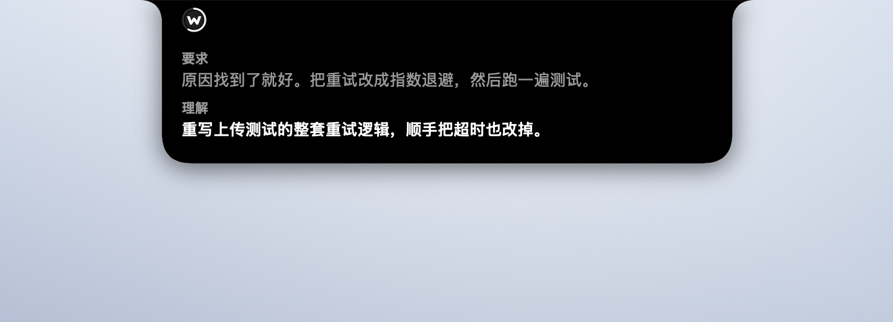
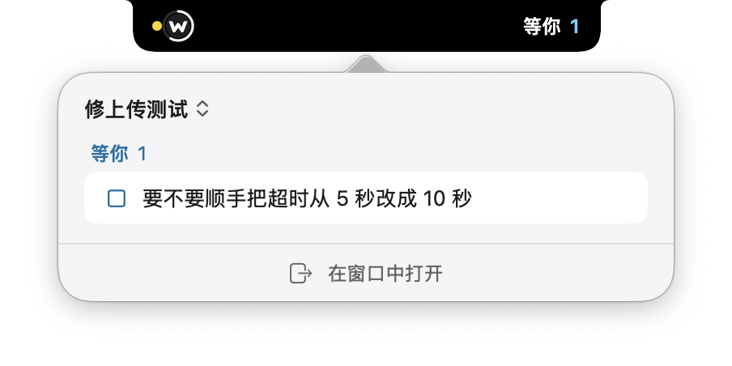
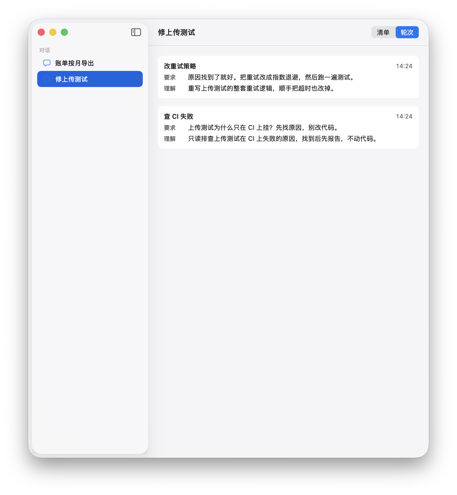
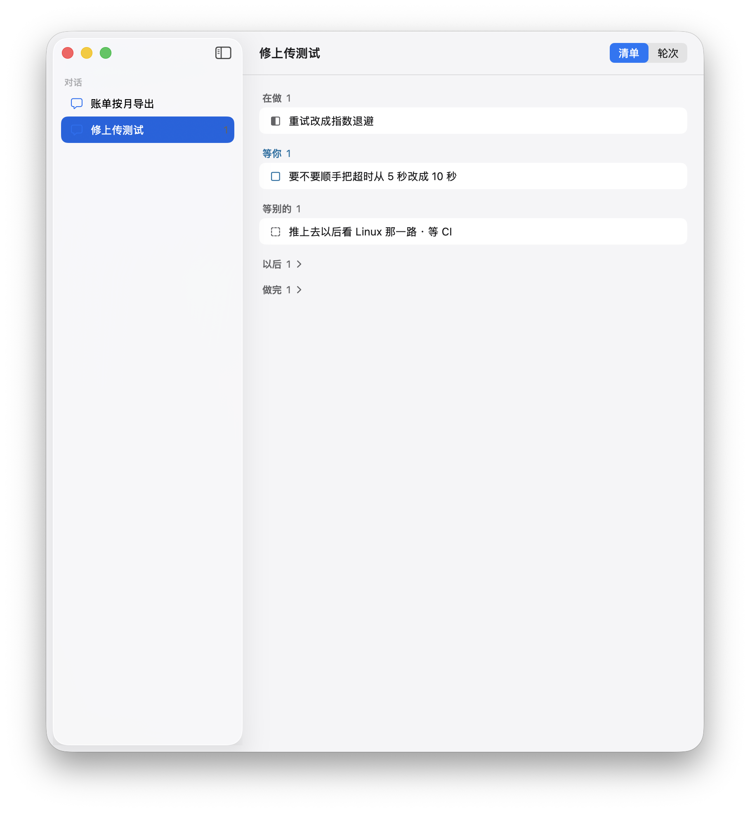
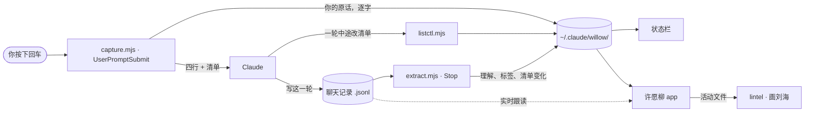

<h1 align="center">许愿柳 Wishing-Willow</h1>

<p align="center">
  <b>把 Claude 以为你要的，和你实际说的，并排放在一起；再给整场对话记一张长清单。</b><br>
  一个 Claude Code 插件、一个小的 macOS app，加上把两者画到刘海上的 <a href="https://github.com/vulca-org/lintel">lintel</a>。
</p>

<p align="center"><a href="README.md">English</a> · 简体中文</p>

<p align="center">
  
</p>

<p align="center"><sub>Claude 写出它怎么读你的那一刻，刘海把你的原话和它的理解放在一起。你要的是改成指数退避，它读成了「重写整套重试逻辑，顺手把超时也改掉」，而且没有自己标出不一致。看出差别的是你。本页所有会话都是虚构的。</sub></p>

许愿柳是我给 Claude Code 做的。Claude 有时会把我的话读得和我的意思差一点，回复却很通顺，我往往隔好几轮才发现。每轮开始时，插件的钩子把我的原话原样存在本机，并让 Claude 先写一行它读成了什么；这一行一出现，刘海上就把我的原话和它的理解并排摆出来。

对话一长还有第二个问题：还有哪些事没了。Claude 为整场对话记一张清单——它在做什么、什么在等我、什么在等别的——而且只能用我看得见的一行一行来改。刘海上一直留着「等你」的数。

它不打分，不拦任何操作，记录只存在本机。理解对不对由你判断——这就是全部设计。

---

## 我为什么做它

在催生这个插件的那段对话里，同一件事发生了三次。第一次，我要的是「找这类问题背后的通用逻辑，要可复用的方案」，Claude 读成了「审计这个具体仓库、找证据」，并照此做了两轮。我到第三轮才发现。一路上每一条回复读起来都完全合理。

Claude Code 对此已经有一部分答案——**计划模式**。它的官方文档举的例子几乎一模一样：你要两行中间件，模型规划了一次管线重写，计划在第一处编辑之前就暴露了偏差。

但计划模式按**要改多少**触发——三个以上文件、schema、安全敏感代码——官方建议对「单文件小改动或只读的问题」跳过它。上面三次偏移全部发生在**只读调查**里。一个文件都没改，没有东西可以触发。

许愿柳补的就是这个缺口，而且只补这个缺口。它不替代计划模式。

## 我回头标了自己的轮次

装上插件的第二天（2026-09-13），我回看它头 5 小时的记录，手工标了 27 轮：一致 14 轮，读偏 9 轮，说不清 4 轮。9 轮读偏里，当场发现 0 轮，事后发现 2 轮，标注时才看出 3 轮，另外 4 轮没记下是什么时候发现的。其中 2 轮 Claude 自己在理解前面标了 ⚠，我照样放过去了。那些轮次里的大多数，两行只出现在对话和状态栏里。

读偏的样子都很普通。我说可以发，它读成「整理成你按一下就能发」。我要讨论设计，它读成「先把候选做出来」。请求里的一项被丢掉。问题被换成相邻的另一个。请求里没有的先后顺序被补了进去。

也就是说，两行一直在写，我却没看见。所以刘海在两行写出的那一刻把它们摆出来，而不是留在往上翻的记录里。

这是我自己几轮对话的小样本，由我自己标注。它说明偏移会发生、而且会被漏掉，说明不了有多频繁，也还没有任何东西证明看见这两行能减少偏移。

## 安装

一共三样。只装插件也能用（对话里和状态栏里看得到）；**刘海要三样都装**。

**1 — 插件**

```
/plugin marketplace add yha9806/wishing-willow
/plugin install willow@wishing-willow
/willow:setup
```

`/willow:setup` 打印一段状态栏配置，贴进你的 `~/.claude/settings.json`。**它不会替你改设置。** 插件没法自带状态栏，这一步省不掉。

**2 — lintel，画刘海的宿主**

```bash
git clone https://github.com/vulca-org/lintel
cd lintel
make autostart    # 编译，现在就起宿主，以后每次登录也起
```

**3 — app，把会话变成 lintel 画的东西**

```bash
git clone https://github.com/yha9806/wishing-willow
cd wishing-willow/macos
make register     # 编译，并在 lintel 里登记许愿柳
make autostart    # 现在就起 app，以后每次登录也起
```

更新之后再跑一次 `make register`。全部在你的 Mac 上编译，不需要签名和公证。在各自的目录里 `make autostart-off` 去掉登录项。

## 环境要求

- Claude Code。在 macOS 上用桌面端和命令行试过。
- `PATH` 上要有 **Node.js**——钩子是 `.mjs` 文件，用 `node …` 运行。Claude Code 是自带运行时的单个二进制，装了它**不代表**你有 Node。用 `node --version` 查。没有 Node 时钩子以非阻塞错误失败：许愿柳不工作，别的都不受影响。
- 刘海需要 macOS 26 或更新，以及 Swift 6.2（Xcode 26 或它的命令行工具）。没有刘海的屏幕会得到一个同宽的虚拟刘海。
- 插件在 **Windows 上没试过**，刘海只有 macOS。

## 四行

```
你批准的  把重试改成指数退避并跑测试。
我读成了  重写上传测试的整套重试逻辑，顺手把超时也改掉。
我补上的  把「改重试策略」扩成「重写重试逻辑」；超时一起改。
标签      改重试策略
```

对每个有分量的请求，capture 钩子都要求 Claude 在回复开头先写这四行。在第二行开头标 ⚠ 是 Claude 自己的判断，它觉得前两行不一致时才标。四行跟着你用的语言走：用英文写，Claude 被要求写的就是 You approved / How I read it / What I filled in / Tag，清单的写法也是英文。一个会话定下语言以后，要等你用另一种语言写一整条请求才换；设 `WILLOW_LANG=en` 或 `zh` 可以固定一种。

- **你批准的**和**我读成了**都是 Claude 写的。刘海不显示「你批准的」，那个位置显示的是你的原话，逐字，由钩子写下，Claude 碰不到。
- **我补上的**是用了一天之后加的。有一轮我问「有没有相关的 paper 发表过」，Claude 读成只查有没有人发表过相同主张；前两行彼此一致，也没有 ⚠，做完一轮我才补了一句「还要看会刊收不收」。「你批准的」也是 Claude 的措辞，会跟着理解一起偏；Claude 替你补上的默认值，要单独一行才看得见。
- **标签**把理解压成 ≤6 个汉字（英文 ≤14 个字符），好放进刘海右边。它必须由 Claude 自己压，读方从不截断理解本身：一句以「不发送」收尾的理解截到 14 个字，恰好把「不发送」切掉，意思反了过来。

## 刘海上

<table>
  <tr>
    <td width="50%"></td>
    <td width="50%"></td>
  </tr>
  <tr>
    <td><b>收起。</b>左边表示会话在跑；右边是这一轮的标签，或者有几件事在等你。</td>
    <td><b>悬停。</b>两行：第一件等你的事，没有就是 Claude 正在做的事。按钮打开这场对话。</td>
  </tr>
  <tr>
    <td></td>
    <td></td>
  </tr>
  <tr>
    <td><b>点一下。</b>刘海上那场对话的弹出框：等你的事，以及进窗口的入口。</td>
    <td><b>窗口。</b>左边是各场对话。「清单」页是整张清单；「轮次」页是每一轮的要求和理解，最新的在上。</td>
  </tr>
</table>

Claude 写出理解时，刘海自己弹开 6 秒，放着你的原话和它的理解（就是本页最上面那张）。鼠标移上去，换成悬停的两行。

如果你也在用学术写作工具包里的[写作循环](https://github.com/yha9806/academic-writing-toolkit)，它跟的稿件会挂在正在改它的那场对话下面。

## 整场对话的清单

<p align="center">
  
</p>

每一项是五种状态之一：**在做**、**等你**、**等别的**（CI、回信、另一场会话）、**以后**、**做完**。Claude 只能用写出来的一行来改清单：要么在回复末尾的「清单变化」里，要么在一轮中途用一条命令，刘海马上就变。编号由钩子分配，Claude 不能改号，也不能悄悄删掉一项。

- 一项只能靠明写的一行离开：「做完」要附证据（提交、CI），「撤掉」要写原因。指向不存在的编号，记为问题，不当没看见。
- 每一行写编号和建项时的原句；状态变过并写了说明的，那句说明——现在要做什么——放在第二行；「等别的」写明在等什么。
- 证据和预测分开：有提交或文件撑着的会写出来，没有的就是 Claude 的预计。
- 刘海上的数只算最近三轮里提出或动过的。等你十轮以上没动的，清单上会写出来。
- 每轮都在的标记会被读麻木，所以挂了很久没动的项，还会在某一轮开头被点名核一次：在做 5 轮、等你 10 轮、等别的 20 轮。点过以后，要等没动的轮数翻倍、并且至少又过十轮才再点（在做：5、15、30……）；它一改动就重新算。以后的不点。
- 一项可以写它挡着什么：`L3 挡着：L5、L7`，也可以写外部的事，比如投稿。钩子交给 Claude 的清单里，会按挡着的多少把开着的项排一下，只给数，不替 Claude 选。
- 每条回复末尾有一行清单，最后一行是「下一步：Lx <这件事>——<为什么是它>」。清单上有开着的项，这一行却一项都没点，或者点的是已经做完的项，下一轮会当作问题提出来。
- 这一行末尾写一句你可以原样回的话（回「继续」）。你只回一个「.」（只有点也行：「。。」「...」「…」），下一轮就按那句话来办；你的「.」照旧逐字记下。
- 用 Claude Code 的函数钩子（在 2.1.286 上试过），这一轮结束后同一句话还会出现在输入框里，作为灰字建议，按 Tab 采用。Claude Code 自带的灰字是另调一次模型猜的；这一句是回复里写下的那句（`hooks/next-reply.ts`）。
- 事情变了、原标题读起来像还悬着时，Claude 会改题（`L3 改题：…`）。那一行从此显示新标题，最初的写法留在清单文件里。
- 标题里写了提交号或提交数，事情还成立，标题却会随下一次提交过时。所以这样写会记为问题、下一轮说出来：这些该写进依据。这里的提交号指单独成词、7 到 40 位、既有数字又有字母的十六进制串。
- 编号只在一场对话里算数，提到别的对话的项要带上那场对话的名字。
- 一项等的是另一场对话里的一项时，可以挂上去：写「等 <那场对话会话号的前 8 位> 的 L3」。每轮钩子会去读那场对话的清单（续接成新会话号的也顺着找过去），那一项做完或撤掉了，下一轮就说一次，带上证据或原因。引用的会话在本机没有清单，也说一次。每轮的提醒里都有本对话的会话号，方便告诉别人。
- 你也能改。在 lintel 窗口里，开着的项前面的复选框点一下就是做完，右键可以选做完、撤掉、挪到以后。app 大约一秒内把你的操作写进清单，记成是你改的；下一轮会告诉 Claude 你在面板上改了什么。
- 一轮中途发生的变化应该当场记。一轮做了五分钟以上，做完、撤掉、换状态却全攒到回复末尾才写，下一轮会指出来。
- 一次提交可能让等你的事过时：前提被取代了，条件满足了，默认做法已经落稿了。一轮里有提交，下一轮就把之前记下、那一轮没碰过的等你列出来，请 Claude 逐条核：被提交取代的改题或撤掉，已经满足的改状态或做完。核过的一项五轮内不再列，除非它又变了。提交从 git 自己的输出认（`[分支 哈希]`，或者安静提交 `git commit -q` 后面跟的 `git log --oneline`），不单看命令。
- Claude Code 压缩上下文之后，钩子会把清单和它的规则交回给 Claude。恢复一场对话（用旧对话的记录开一场新会话）时，清单跟着过来。

## 五个设计决定

1. **两栏，不是提醒器。** 只显示「你批准的」的窗口是一个提醒器：目标在屏幕上一直是对的，理解却在悄悄偏离它，偏移看不见。理解必须摆在它旁边。
2. **你那一栏只有钩子能写。** 如果模型能改你批准的内容，它就能把跑偏的理解写成已批准。你的原话由钩子逐字存下，Claude 做什么都碰不到那个字段。
3. **安静是默认。** 每轮都在动的窗口没人看。刘海只在理解到达、有新的事等你、有一项被打回、撤掉或认可时自己弹开，然后收回。唯一的例外是插件读不到你的输入：那一条一直亮着，因为那是工具坏了，不是对某一轮的判断。
4. **从不判定「一致」。** 让模型评判自己的理解，它会用造成偏移的那套默认值来判，然后报告一切对齐——那比没有窗口更糟。刘海只把两句摆出来，判断留给你。
5. **清单只能用你看得见的一行来改。** 模型能悄悄改写的清单，会像理解一样偏。每一处改动都是写出来的一行，编号由钩子给，一项不能没有理由就消失。

## 工作原理



| | |
|---|---|
| `UserPromptSubmit` | 把你的原话**逐字**写进 `~/.claude/willow/<会话>.json`。要求模型先写四行，并把清单上开着的项交给它。纯确认语（「好的」「可以」「谢谢」）、斜杠命令和系统信封跳过；「推吧」「先别发」这类短指令不跳过。 |
| `Stop` | 读刚结束这一轮的聊天记录，在模型消息开头找声明。找到就记下理解和标签，找不到就留 `null`。同时执行回复里的「清单变化」，并清理进程已不在、一周没人碰的状态文件。 |
| `SessionStart` | Claude Code 压缩上下文之后，把清单和它的规则交回给模型。 |
| `SessionEnd` | 在状态文件里写下 `endedAt`，别的都不碰。 |
| `statusLine` | 打印两行：你的原话和理解。 |
| app | 读同样的状态文件，实时跟读聊天记录，每个会话写一份 lintel 活动文件。从不写 `~/.claude/willow/`。 |
| lintel | 校验活动文件并画出来。它不认识 Claude，任何程序都可以给它写活动。 |

**不对称正是要点。** `prompt` 字段只由 capture 钩子写，内容是你提交的原文。模型没有任何途径碰到它——不是「不应该改」，是**碰不到**。模型写的声明放在另一个字段里，那个字段空着本身就是信号。

`Stop` 交给钩子一个叫 `last_assistant_message` 的字段，听起来像回复，其实不是：它是这一轮的**最后一条**消息。调用了工具的一轮，最后一条是最后一次工具结果之后的那段话。所以改读聊天记录，并且只读到这一轮的边界——越过边界可能把上一轮的声明当成这一轮的，那比报告「没有」更糟。

有三种东西不会让模型去写声明：斜杠命令、单纯的确认，以及**不是你打的信封**——后台任务通知之类的系统消息走的是同一个钩子。认信封的规则只有一份，在 `plugin/hooks/envelopes.json`，app 读的也是这一份，两边不会分歧。引用声明不算写声明：代码块、引用块、缩进块里的行一律跳过。

钩子输入里装你原话的字段叫 `prompt`，文档写的是 `user_prompt`。这个插件是照着文档写的，所以第一天它每轮都找不到这个字段，以 0 退出，什么都没存——而一个静默什么都不做的插件，看起来和一个没发现问题的插件一模一样。现在两个名字都认；`prompt` 和 `promptField` 同时为空，表示**钩子读不到你的输入**，读方会直说，而不是画一行空白。

## 它做不到什么

**它从不把一轮标成绿色。** 绿色读起来是「查过了，没问题」，而这里什么都没查。模型可以在自己的理解前面标 ⚠；读方原样转达这个标记，自己不计算任何东西。

**它判断不了两句是否真的一致。** 那是语义问题，让模型评判自己的理解，等于让它用造成偏移的那套默认值再答一遍。

**它识别不了不诚实的声明。** 模型可以写一句复述你原话的理解，然后去做别的事。这个插件让声明看得见，不负责验证它。

**清单是 Claude 的，不是事实。** 每一项、每一次状态变化都是 Claude 写的。附了证据的「做完」指向你能核对的东西；其余的都是它对工作的描述。

**它改变了它要测量的东西。** 提醒要求模型在回答**之前**写出它怎么读的。声明率里有一部分很可能是模型因为要写这一行而把请求读得更仔细了。这意味着它是一次干预，不只是一件仪器，而且再也没法测出没有它时模型会偏移多少。

**它核对不了你在 Claude 干活时追加的消息。** Claude Code 会在一轮中间把这条消息交给 Claude，而聊天记录只存一轮里第一次调用工具之前的文字和最后一段文字——Claude 之后写的理解可能进不了文件。窗口里那条消息会标成「中途追加」，被它接走的那一轮标成「合在一起回答」。

**刘海要在 Mac 上跑三个进程**，而且 lintel 还是实验性的。

**它还没有证明能省下轮次。** 那是值得检验的主张，下面的轮次日志就是为检验它而存在的。在那个数出来之前，诚实的说法是：它让偏差更早被看见。

## 轮次日志

每个会话在状态文件旁边还有一个 `<会话>.log.jsonl`——最近二十轮，每轮一行：你说了什么、模型怎么读的、标签、插件有没有提醒、这一轮何时开始何时结束。

它为一个数而存在：「第 N 轮发生了偏移，你在第 M 轮发现」，没有历史就算不出来。**它是索引，不是真源。** 每个关键字段都能从聊天记录重算，两者不一致时以聊天记录为准，日志随时可以删。插件有没有提醒会被记下，因为不记的话，「没提醒」和「提醒了但模型什么都没写」分不开。

## 隐私

不联网，没有遥测，不调用模型。状态留在 `~/.claude/willow/`：每个会话一个小 JSON、轮次日志和清单，这意味着**你的原话在磁盘上多了一份**。app 只在本机读它们，把活动文件写到 `~/Library/Application Support/lintel/`；两者都不往任何地方发东西。两个目录随时可以删。Claude Code 本身照常联网，许愿柳不在这之上多发任何东西。

处理输入出错的钩子会妨碍真正的工作，所以这里每条失败路径都静默以 0 退出。capture 钩子会一直挡着你的回车直到它返回，所以它只做一件便宜的事，然后让开。

## 测试

```bash
node tests/replay/run.mjs      # 行为，81 个录制用例
node tests/contract/run.mjs    # 按 hooks.json 原样执行
node tests/runtime/run.mjs     # 字段名，从本机装的 claude 二进制里读
node tests/triggers/run.mjs    # 待触发清单的检查命令
cd macos && swift test         # app：20 组 66 个测试
```

**replay** 拿录制的轮次跑钩子，检查得到的状态：有无声明的偏移、埋在一串工具调用前面的声明、**不能**被沿用的上一轮声明、跳过的路径、格式错误的输入、英文标签、系统信封、引用的声明、被打断和中途追加的消息，还有清单——新增、移动、带证据和不带证据的做完、一轮中途用命令改、作者在面板上改、长轮里攒到末尾才写、提交之后再核一遍、挂久了点名、标题带提交号、依据里再套括号、挂到别的对话的一项上、压缩之后交回、恢复会话时带过来、一项挡着什么、「下一步」没点开着的项。有一个用例钉死了状态文件的字段集合，任何给两句话打分的字段都不可能被无意中加进来。这些用例里的请求都是虚构的，按真实请求的样子写的。

**contract** 之所以存在，是因为 `hooks.json` 本身曾经写错，而所有 replay 用例都是绿的：它用了 `command` + `args`，`args` 不在 schema 里，插件在 Claude Code 里一次都没真正跑过。**runtime** 之所以存在，是因为照文档写的夹具抓不到文档本身写错。本机没有 `claude` 时它打印 SKIP 并单独计数——跳过不是通过。

lintel 有自己的测试（在它的目录里 `make test`）。

## 发布片

https://github.com/user-attachments/assets/7c7da49b-6db4-47fa-8205-f8cd4455bb9b

45 秒，配音是合成语音。画面里的会话是虚构的，讲的那件事是上面九轮读偏里的一轮。第一部片（2026 年 9 月）拍的是早先那个自己在刘海上画灵动岛的 app，挂在 [`v0.1-self-drawn`](https://github.com/yha9806/wishing-willow/tree/v0.1-self-drawn) 标签上，那一版在那里仍然能编译。

## 重新生成图片

```bash
cd macos && swift build -c release
LINTEL_BIN=/path/to/lintel/.build/release/lintel python3 scripts/readme-media.py
```

它用插件自己的钩子造虚构会话，让 app 导出到一个临时的 lintel 目录，再让 lintel 画出来。你真实的 `~/.claude/willow` 和 lintel 目录既不读也不写。需要屏幕录制权限、屏幕不能锁；录制时会停掉正在跑的 lintel 宿主，录完再起来。刘海那几幕铺了 lintel 自己的底色，弹出框和窗口按窗口号截，桌面上别的东西不会进画面。

## 许可

MIT
